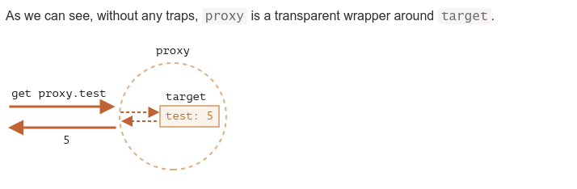

### Proxy и Reflect(Proxy and Reflect)

https://learn.javascript.ru/proxy

- `about`
    - доработать потом, дописать из сайта, что не дописал,
    - добавить примеры из практики итд

- `codes`
    - [code](../../codes/14-js-misc/_1-proxy.ts)

- `external link`
    - https://dev.to/rajeshroyal/what-is-the-use-of-proxy-and-reflect-in-javascript-1a02
    - https://www.youtube.com/watch?v=np08WdS9OXg&list=PLqKQF2ojwm3l4oPjsB9chrJmlhZ-zOzWT&index=9&ab_channel=%D0%92%D0%BB%D0%B0%D0%B4%D0%B8%D0%BB%D0%B5%D0%BD%D0%9C%D0%B8%D0%BD%D0%B8%D0%BD
    - https://www.youtube.com/watch?v=mSbyhHfxs04&list=PLqKQF2ojwm3l4oPjsB9chrJmlhZ-zOzWT&index=10&ab_channel=%D0%92%D0%BB%D0%B0%D0%B4%D0%B8%D0%BB%D0%B5%D0%BD%D0%9C%D0%B8%D0%BD%D0%B8%D0%BD


- Объект `Proxy` «оборачивается» вокруг другого объекта и может перехватывать (и, при желании, самостоятельно
  обрабатывать) разные действия с ним, например чтение/запись(read, write) свойств(property) и другие. Далее мы будем
  называть такие объекты `proxy`.
- `Proxy` используем если мы хотим отлавливать значения перед исполнением кода. То есть делаем некую обертку декоратор
  для типов данных

```js
let proxy = new Proxy(target, handler);
```

- `target` – это объект, для которого нужно сделать прокси, может быть чем угодно, все типы данных, инстанция класса,
  функция.
- `handler` - конфигурация прокси: объект с «ловушками» («traps»): методами, которые перехватывают разные операции,
  например, ловушка get – для чтения свойства из target, ловушка set – для записи свойства в target и так далее.

- `handler` методы
    - get
    - set
    - has
    - deleteProperty
    - apply
    - construct
    - getPrototypeOf
    - setPrototypeOf
    - isExtensible
    - preventExtensions
    - defineProperty
    - getOwnPropertyDescriptor
    - ownKeys


- `Proxy` следует использовать везде вместо target
- `Proxy` должен заменить собой оригинальный объект повсюду. Никто не должен ссылаться на оригинальный объект после
  того, как он был проксирован. Иначе очень легко запутаться.
- `Proxy` грубо говоря нужен, для того чтобы отслеживать изменения любых свойств в объекте

```js
target = new Proxy(target, handler);
```



- `Reflect` – встроенный объект, упрощающий создание прокси.

- `Reflect` методы
    - Reflect.get
    - Reflect.set
    - Reflect.deleteProperty
    - Reflect.construct

- `Reflect` дает возможность достучаться до оригинального объекта и получить значения и изменять их. Минуя `Proxy`
- `Reflect` API создано как дополнение к `Proxy`. Для любой ловушки из `Proxy` существует метод в `Reflect` с теми же
  аргументами. Нам следует использовать его, если нужно перенаправить вызов на оригинальный объект.


- как Это работает `Proxy` под капотом js

```js
//  где то под капотом js если грубо представить

let obj = {}

class Proxy {
  constructor(obj, handler) {
    Object.defineProperty(obj, 'anyProp', {
      get() {
        if (handler.get) {
          handler.get(obj, 'anyProp', obj)
        }
        return obj.anyProp
      },
      set
    })
  }

}


```

```js
//  где то под капотом js если грубо представить


class Proxy {
  constructor(obj, handler) {
    // метод под капотом js который реализован нативно  в движке 
    beforeChangeProperyListener(obj, (obj, pro, value) => handler.set(obj, pro, value, obj))
    // метод под капотом js который реализован нативно  в движке 
    beforeCallPropertyListener(obj, (obj, pro) => handler.get(obj, pro, obj))
  }
}
```
