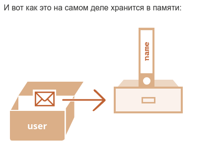
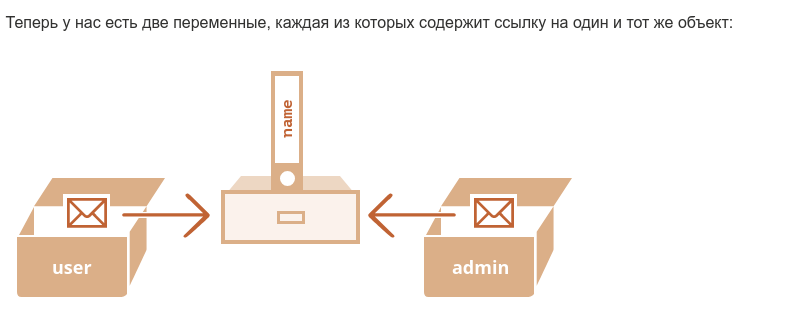

### Копирование объектов и ссылки(Object references and copying)

https://learn.javascript.ru/object-copy

- `terminology`
    - ссылка - reference
    - Сравнение по ссылке - comparison by reference
    - Вложенное клонирование - nested cloning

- `external link`
    - https://developer.mozilla.org/en-US/docs/Web/JavaScript/Guide/Working_with_Objects#creating_new_objects

> Объекты не хранят значения(do not store a value), а хранят только ссылку на значения(just reference)

      let user = {
      name: "John"
      surname: 'John'
      };

       <---user--->   =>     name
       <---user--->   =>     surname

> При копировании переменной объекта копируется ссылка, но сам объект не дублируется.

      let user = { name: "John" };
      let admin = user; // копируется ссылка

**Сравнение по ссылке(Comparison by reference)**

- Два объекта равны только в том случае, если это один и тот же объект.
- И здесь два независимых объекта не равны, даже если они выглядят одинаково (оба пусты):

  let a = {};
  let b = a; // копирование по ссылк
  a == b // true

  let a = {};
  let b = {}; // два независимых объекта
  a == b // false

**Клонирование и объединение, Object.assign(Cloning and merging, Object.assign)**

- для создания независимого объекта можем использовать метод `Object.assign`
- для создания независимого объекта можем использовать обычный `for in` для копирования каждого свойства
- для создания независимого объекта можем использовать `оператор расширения(spread syntax)`
- https://developer.mozilla.org/en-US/docs/Web/JavaScript/Guide/Working_with_Objects#creating_new_objects

  let user = { name: "John" };
  let permissions1 = { canView: true };
  let permissions2 = { canEdit: true };

  // копируем все свойства из permissions1 и permissions2 в user
  Object.assign(user, permissions1, permissions2);
  // теперь user = { name: "John", canView: true, canEdit: true }

>

    let user = {
    name: "John",
    age: 30
    };
    let clone = {}; // новый пустой объект
    // давайте скопируем все свойства user в него
    for (let key in user) {
    clone[key] = user[key];
    }

>

    let clone = {...user}

**Вложенное клонирование(Nested cloning)**

- для создания независимого объекта у которого есть вложенные объекты мы можем использовать готовый метод `_cloneDeep`
  из библиотеки `lodash`
- для создания независимого объекта у которого есть вложенные объекты мы можем
  использовать `JSON.parse(JSON.stringify(obj))`
- для создания независимого объекта у которого есть вложенные объекты мы можем использовать `for in ` с рекурсией для
  вложенных объектов
