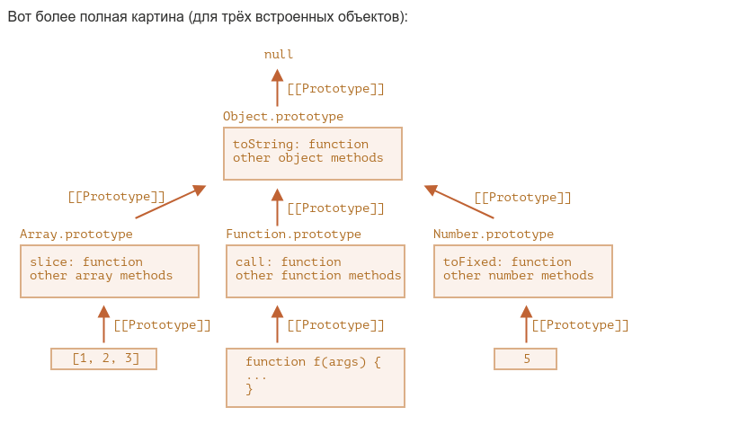

### Встроенные прототипы(Native prototypes)

https://learn.javascript.ru/native-prototypes

- `terminology`
    - asd
- `definition`
    - fdf

#### Есть три способа скопировать методы

1) obj.join = Array.prototype.join;
2) obj.join = [].join;
3) [].join.call(arguments)



- Изначально в js для каждого типа встроили [[Prototype]], внизу стоит примеры, как реализовано под капотом

```js

//встроенные движком js функции 
function Object() {

  let prototype = {constructor: Object, __proto__: null};

  function toString() {

  }

  function valueOf() {

  }

  function create() {

  }


  function seal() {

  }

  prototype.toString = toString;
  prototype.valueOf = valueOf;
  Object.prototype = prototype;

  // create property for Object function
  Object.create = create;
  Object.seal = seal;

  // где то под капотом js движка 
  // const this = {
  // __proto__: f.prototype
  // }
  // return this

}


//встроенные движком js функции
function Function() {

  let prototype = {constructor: Object, __proto__: Object.prototype};

  function call() {

  }

  function apply() {

  }

  prototype.call = call;
  prototype.apply = apply;

  Function.prototype = prototype

  // где то под капотом js движка 
  // const this  ={}
  // this.__proto__ = Function.prototype
  // return this

}

```

```js


function customObject() {
  let prototype = {constructor: customObject, __proto__: Object.prototype};
  customObject.prototype = prototype


  // где то под капотом js движка 
  // const this = {}
  // this.someProperty = 234 //created  custom property 
  // this.__proto__  = customObject.prototype
  // return this

}

let co = new customObject();
new co.constructor()

```

**Как для функции создавать свойства в [[Prototype]] через `Function`**

```js
Function.prototype.defer = function (ms) {
  let f = this;
  return function (...args) {
    setTimeout(() => f.apply(this, args), ms);
  }
};

// check it
function f(a, b) {
  alert(a + b);
}

f.defer(1000)(1, 2); // выведет 3 через 1 секунду.

```

**Как для вложенных методов создавать свойства в [[Prototype]] без изменения функции `Function`**

```js

var ads = {
  name: 'asf',
  bo() {
    console.error(this.name)
  },
  createPrototypeForNestedMethod() {
    const prototype = {
      defer(context) {
        this.apply(context)
      },
      __proto__: Function.prototype
    }
    Object.setPrototypeOf(this.bo, prototype)
  }
}
ads.createPrototypeForNestedMethod();

ads.bo.defer(ads)


```

- Написать разницу между `this`, `f.prototype` и `f[property]` в new f();_
    - первое отличие то что если мы записываем метод в `this` то у нас нет доступа до метода пока не создадим инстанцию
      через `new f()`
    - если метод напишем в `f.prototype` то мы можем достучаться до этого метода без создания инстанции. а
      Напрямую `f.prototype.method()`
    - если свойства(property)(любой тип данных) будем записывать в `this` то каждая созданная инстанция через `new f()`
      будет создавать в инстанции все свойства и каждое свойство будет собственным и для каждого свойства будет выделено
      отдельная память в ОЗУ. Потому что каждая инстанция будет уникальной друг от друга
    - если свойства(property)(любой тип данных) будем записывать в `f.property`. то при создании инстанции
      через `new f()`  свойства не будут уникальными для каждой новой инстанции, а все свойства в `f.prototype` будут
      общими что очень хорошо будет влиять на память, потому что f.prototype свойства в одном экземпляре, а инстанции
      могут быть тысяча, значит для каждого свойства не нужно выделять каждый раз отдельную ячейку памяти при создании
      инстанции
    - `f[property]` отличается от `this`. Все что создается через `f[property` это относится только к самой функции
      никак не к инстанции, не к чему либо еще
    - `f[property]` отличается от `f[prototype]`. `f[property]` не имеет связки с инстанциями. а `f[prototype]` имеет
      связь с инстанциями, каждая инстанция имеет ссылку до `f[prototype]`

```js

function createThis() {
  this.name = 'name';
  this.someName = 'someName'
  this.method = function () {
    console.error(this.name)
  }
}

function createPrototype() {
  createPrototype.prototype.method = function () {
    console.error(this.name)
  }

  createPrototype.methodF = function () {

  }

}

let thisObj = new createThis();
//thisObj.name // это созданный объект со своим собственным свойством
//thisObj.someName // это созданный объект со своим собственным свойством
//thisObj.method // это созданный объект со своим собственным свойством

let prototypeObj = new createPrototype();

// prototypeObj.method // этот метод берется с прототипа. у prototypeObj нет своего собственного метода
// prototypeObj.methodF // этого метода нет н выдаст undefined потому что у инстанции нет такого метода и у прототипа тоже 
// createPrototype.methodF // это свойство отностися только к  функции и к другим не имеет никакого отношения 
// createPrototype.prototype // это свойство относится к функции а также к нему будут иметь ссылку все инстанции которые были созданы через new createPrototype() 

```
