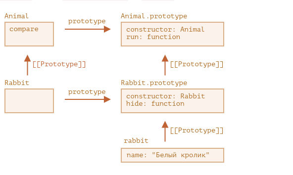

### Статические свойства и методы(Static properties and methods)

https://learn.javascript.ru/static-properties-methods

- `terminology`
    - fsd

- `definition`
    - dasdsa


- Что такое статические методы в функции `f` и в классах `c`
    - это обычные свойства функции которые доступны из вне
    - а также мы можем унаследовать их (прототипное наследования свойств функции)

```js
// Разберем как реализовать статичный метод в js через функцию а также наследования
function f() {

}

f.prototype.run = function () {

}

f.compare = function () {

}

function fExtends() {

}

// мы сначала меняем у fExtends.prototype [[Prototype]]  на f.prototype  это нужно для корректной работы новых инстанции которые создаются через `new f()` чтоб прототипное наследования работало корректно
Object.setPrototypeOf(fExtends.prototype, f.prototype)
// fExtends.prototype.__proto__ = f.prototype && f.prototype.__proto__ = Object.prototype && Object.prototype.__proto__ = null


// Также мы должны у функции [[Prototype]] наследовать от другой функции чтоб наследованная функция имела доступ до свойств другой функции. Это означает что мы имеем доступ до статических методов родительского класса
Object.setPrototypeOf(fExtends, f)
// fExtends.__proto__ = f && f.__proto__ = Function.prototype && Function.prototype.__proto__ = Object.prototype && Object.prototype.__proto__ = null

// получается для полного наследования от другого класса нужно учитывать  
// 1 нужно функция наследовала от другой функции 
// 2 нужно прототип функции наследовала от прототипа другой функции


fExtends.compare() // прототипное наследования свойств функции от родительской  функции

// теперь все это напишем через class

class C {

  static compare() {

  }
}

class CExtends extends C {

}

CExtends.compare() // наследования статичных свойств от родительского класса


```

- При наследовании что к чему будет равен

```js

function f() {

}

function fExtends() {

}

Object.setPrototypeOf(fExtends, f,)
Object.setPrototypeOf(fExtends.prototype, f.prototype)

f.__proto__ === Function.prototype
f.__proto__.__proto__ === Object.prototype

f.prototype === {construcotr: f}
f.prototype.__proto__ === Object.prototype


fExtends.__proto__ === f // функция fExtends будет иметь все свойства функции f
fExtends.__proto__.__proto__ === Function.prototype

fExtends.prototype === {constructor: fExtends, __proto__: f.prototype}
fExtends.prototype.__proto__ === f.prototype // созданная инстанция будет иметь все свойства f.prototype
fExtends.prototype.__proto__.__proto__ === Object.prototype


```



