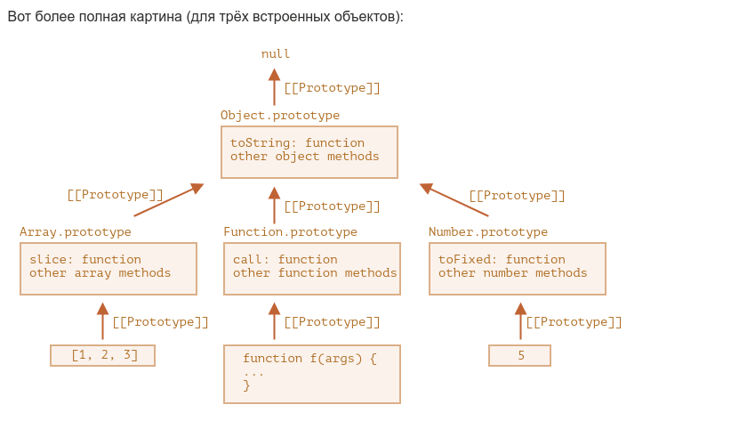

### Основы JavaScript(JavaScript Fundamentals)

- Привет, мир! - Hello, world! [hello-world](chapters/2-first-steps/hello-world.md)
- Структура кода - Code structure [structure](chapters/2-first-steps/structure.md)
- Строгий режим — "use strict" - The modern mode, "use strict" 
- Переменные - Variables [variables](chapters/2-first-steps/variables.md)
- Типы данных - Data types [types](chapters/2-first-steps/types.md)
- Взаимодействие: alert, prompt, confirm - Interaction: alert, prompt, confirm 
- Преобразование типов - Type Conversions [type-conversions](chapters/2-first-steps/type-conversions.md)
- Базовые операторы, математика - Basic operators, maths [operators](chapters/2-first-steps/operators.md)
- Операторы сравнения - Comparisons [comparison](chapters/2-first-steps/comparison.md)
- Условное ветвление: if, '?' - Conditional branching: if, '?' [ifelse](chapters/2-first-steps/ifelse.md)
- Логические операторы - Logical operators [logical-operators](chapters/2-first-steps/logical-operators.md)
- Оператор нулевого слияния (??) - Nullish coalescing operator '
  ??' [nullish-coalescing-operator](chapters/2-first-steps/nullish-coalescing-operator.md)
- Циклы while и for - Loops: while and for [while-for](chapters/2-first-steps/while-for.md)
- Конструкция "switch" - The "switch" statement [switch](chapters/2-first-steps/switch.md)
- Функции - Functions [function-basics](chapters/2-first-steps/function-basics.md)
- Function Expression - Function expressions [function-expressions](chapters/2-first-steps/function-expressions.md)
- Стрелочные функции, основы - Arrow functions, the
  basics [arrow-functions-basics](chapters/2-first-steps/arrow-functions-basics.md)
- Особенности JavaScript - JavaScript specials [javascript-specials](chapters/2-first-steps/javascript-specials.md)

### Качество кода(Code quality)

- Отладка в браузере - Debugging in the browser 
- Советы по стилю кода - Coding Style 
- Комментарии - Comments 
- Ниндзя-код - Ninja code 
- Автоматическое тестирование c использованием фреймворка Mocha - Automated testing with
  Mocha 
- Полифилы - Polyfills and transpilers  [polyfills](chapters/3-code-quality/polyfills.md)

### Объекты: основы(Objects: the basics)

- Объекты - Objects [object](chapters/4-object-basics/object.md) || [code](codes/object-basics/_2-object.ts)
- Копирование объектов и ссылки - Object references and copying [object-copy](chapters/4-object-basics/object-copy.md)
- Сборка мусора - Garbage collection [garbage-collection](chapters/4-object-basics/garbage-collection.md)
- Методы объекта, "this" - Object methods, "this" [object-methods](chapters/4-object-basics/object-methods.md)
- Конструктор, оператор "new" - Constructor, operator "
  new" [constructor-new](chapters/4-object-basics/constructor-new.md)
- Опциональная цепочка '?.' - Optional chaining '?.' [object-basics](chapters/4-object-basics)
- Тип данных Symbol - Symbol type [symbol](chapters/4-object-basics/symbol.md)
- Преобразование объектов в примитивы - Object to primitive
  conversion [object-toprimitive](chapters/4-object-basics/object-toprimitive.md)

### Типы данных(Data types)

- Методы примитивов - Methods of primitives  [primitives-methods](chapters/5-data-types/primitives-methods.md)
- Числа - Numbers 
- Строки - Strings 
- Массивы - Arrays 
- Методы массивов - Array methods 
- Перебираемые объекты - Iterables 
- Map и Set - Map and Set  ||   [code](codes/data-types/_8-map-set.ts)
- WeakMap и WeakSet - WeakMap and WeakSet 
- Object.keys, values, entries - Object.keys, values, entries 
- Деструктурирующее присваивание - Destructuring
  assignment [destructuring-assignment](chapters/5-data-types/destructuring-assignment.md)
  ||   [code](codes/data-types/_11-destructuring-assignment.ts)
- Дата и время - Date and time 
- Формат JSON, метод toJSON - JSON methods, toJSON 

### Продвинутая работа с функциями(Advanced working with functions)

- Рекурсия и стек - Recursion and stack [recursion](chapters/6-advanced-functions/recursion.md) ||   [code](codes/advanced-function/_2-recursion.ts)
- Остаточные параметры и оператор расширения - Rest parameters and spread || 
  syntax [rest-parameters-spread-operator](chapters/6-advanced-functions/rest-parameters-spread-operator.md)
- Замыкание - Variable scope, closure 
- Устаревшее ключевое слово "var" - The old "var" 
- Глобальный объект - Global object 
- Объект функции, NFE - Function object, NFE 
- Синтаксис "new Function" - The "new Function" syntax 
- Планирование: setTimeout и setInterval - Scheduling: setTimeout and setInterval 
- Декораторы и переадресация вызова, call/apply - Decorators and forwarding,
  call/apply 
- Привязка контекста к функции - Function binding 
- Повторяем стрелочные функции - Arrow functions revisited 

### Замыкание

Лучше с нуля прочитать из сайта и решить задачки

Все созданные функции берут outer lexical environment там где они были объявлены, а не там где они были вызваны

All functions “on birth” receive a hidden property [[Environment]] with a reference to the Lexical Environment of their
creatio

During the execution of makeCounter(), a tiny nested function is created.

It doesn’t matter whether the function is created using Function Declaration or Function Expression. All functions get
the [[Environment]] property that references the Lexical Environment in which they were made. So our new tiny nested
function gets it as well.

For our new nested function the value of [[Environment]] is the current Lexical Environment of makeCounter() (where it
was born):

### Объект функции, NFE

получить название функции

        function getName(){}
        
        getName.name // 'getName'

получить количество аргументов

        function getName(name, surname){}
        
        getName.length // 2

функция это и есть по сути объект, но с большими возможностями

для функции можно задавать свойства как и y объекта

        function getName(){
        
        }
        
        getName.surname ='abu'

также можно и внутри функции объявить, но свойства появится только при вызове
и каждый раз будет перезаписываться

        function getName(){
        getName.surname ='nabu baby'
        }
        getName.surname ='abu'
        
        getName()
        
        console.error(getName.surname) // 'nabu baby'

- `Named Function Expression` = `NFE`

            let say = function getName(){}
            let say = function(){}
            let say = ()=>{}

- interesting code

        function sum(a) {
        
          let currentSum = a;
        
          function f(b) {
            currentSum += b;
            return f;
          }
        
          f.toString = function() {
            return currentSum;
          };
        
          return f;
        }

есть два способа создать объект  
это через сам объект или через функцию
1

      let name = {
      ..some properties
      }

2

    let name = function(){
      function f(){
      }
      f.someProperties  = ...
      
      return f
      }

### Синтаксис "new Function"

        let func = new Function([arg1, arg2, ...argN], functionBody);
        
        let sum = new Function('a', 'b', 'return a + b');
        sum(1, 2); // 3
        
        let sayHi = new Function('alert("Hello")');
        sayHi(); // Hello

`new Function` позволяет превратить любую строку в функцию. Например, можно получить новую функцию с сервера и затем
выполнить её:

`new Function` ее lexical environment сразу смотрит на глобальный, а не на родительский

        function getFunc() {
          let value = "test";
        
          let func = new Function('alert(value)');
        
          return func;
        }
        
        getFunc()(); // ошибка: value не определено~~

### Планирование: setTimeout и setInterval

    ---

### Декораторы и переадресация вызова, call/apply

Лучше с нуля прочитать из сайта и решить задачки

create custom method as call

      let arr: any[] = [];

    // @ts-ignore
    arr.join.myCall = function(context: any) {

      const symbol = Symbol();

      context[symbol] = this;

      const result = context[symbol]();
      delete context[symbol];
      return result;

    };
    // identify 
        console.error(arr.join.call(asf));
        // @ts-ignore
        console.error(arr.join.myCall(asf));

>

    /*
    let object = {
    objectFunction: objectFunction
    }

    let objectFunction = function(){
          this
    }
    objectFunction.someProperties = {}

    object.objectFunction() // object
    object.objectFunction.someProperties

    objectFunction.someProperties // this == objectFunction

    * */

see how to write polyfill for the call(), apply(), and bind() methods in JavaScript

### Привязка контекста к функции

Лучше с нуля прочитать из сайта и решить задачки

как работает bind

    let user = {
      name: 'Vasya',
      sayHi() {
        console.error('this:', this.name);
      }
    };

    function bind(context: any, func: any, ...args: any) {
      return function(...args1: any) {
        return func.apply(context, [...args, args1]);
      };
    }

    let sayHi = user.sayHi.bind(user);
    let sayHi1 = () => user.sayHi();
    setTimeout(sayHi, 100);
    setTimeout(sayHi1, 100);

### Повторяем стрелочные функции

- Не имеют this.
- Не имеют arguments.
- Не могут быть вызваны с new.
- (У них также нет super)

### Флаги и дескрипторы свойств

object properties has another attributes not only value

its called **'flags'** or **"descriptor"**

- _writable_
- _enumarble_
- _configurable_

- writable – если true, свойство можно изменить, иначе оно только для чтения.
- enumerable – если true, свойство перечисляется в циклах, в противном случае циклы его игнорируют.
- configurable – если true, свойство можно удалить, а эти атрибуты можно изменять, иначе этого делать нельзя.

how to get _full_ information about property

      let user = {
      name: "John"
      };
      
      let descriptor = Object.getOwnPropertyDescriptor(user, 'name');
      
      alert( JSON.stringify(descriptor, null, 2 ) );
      /* дескриптор свойства:
      {
      "value": "John",
      "writable": true,
      "enumerable": true,
      "configurable": true
      }
      */

how to clone object with descriptor

     let user = {
      name: 'John'
    };

    Object.defineProperty(PropertyDescriptors, 'name', {
      writable: false
    });

    let userClone = Object.defineProperties({}, Object.getOwnPropertyDescriptors(user));

    let ownPropertyDescriptors = Object.getOwnPropertyDescriptors(userClone);
    console.error(JSON.stringify(ownPropertyDescriptors));

### Свойства - геттеры и сеттеры

Лучше с нуля прочитать из сайта

### Прототипное наследование

дописать

### F.prototype

> как работает F.prototype

       /*
    *
    * let user = {name:'name'}
    * let admin = {__proto__:user}
    * set __proto__(value){
    * [[Prototype]]= value
    * }
    *
    * Object.constructor = Object
    *
    * let initialPrototype = {constructor: Rabbit}
    * Rabbit.prototype = initialPrototype
    * set initPrototype(){
    * [[Prototype]] = this.prototype
    * }
    * rabbit = new Rabbit()
    * new rabbit.constructor() // it's Rabbit constructor
    *
    * Rabbit.prototype = user
    * setInitPrototype(){
    * [[Prototype]] = this.prototype
    * }
    * rabbit = new Rabbit();
    * new rabbit.constructor() // it's Object constructor
    *
    * */

    /*
    Rabbit.prototype = animal
    const rabbit = new Rabbit()

    InitConstructor = {constructor: Rabbit}
    Rabbit  --> constructor --> Rabbit
    Rabbit  --> prototype --> animal
                               ^
                               | [[Prototype]]
                               |
                               rabbit

    * */

    /*
    Rabbit.prototype = {constructor: Rabbit }
    const rabbit = new Rabbit()

    InitConstructor = {constructor: Rabbit}
    Rabbit  --> constructor --> Rabbit
    Rabbit  --> prototype --> InitConstructor
                               ^
                               | [[Prototype]]
                               |
                               rabbit

    * */

### Встроенные прототипы

      /*
    *
    * Изначально в js для каждого  типа встроили [[Prototype]]
    * внизу стоит примеры, как реализовано под капотом
    * */

    /*
    Object.prototype = {toString()}
    let obj ={ __proto__: Object.prototype}

    any create object has default __proto__: Object.prototype

    Function.prototype = {call(), apply()}

    function someFunction(){}
    // someFunction need to see like object
    someFunction.__proto__ = Function.prototype

    let arr = []
    // arr need to see like object
    arr.__proto__ = Array.prototype

    * */

    /*
    * Случай когда нужно создавать свой [[Prototype]]
    * через new Function и через object
    * */

    /*

    ConstructorPrototype = {constructor: f };
    customObject.prototype = ConstructorPrototype
    function customObject(){
    let this = {}
    this.someProperty = 234

    if(new.target){
     this.__proto__ = customObject.prototype
    }
    return this
    }
    let co = new customObject();
    new co.constructor() //it's called ConstructorPrototype

    let user = {name, __proto__:Object.prototype};

    let admin= {__proto__:user};
    admin.name // it's called ConstructorPrototype

    * */

>

    Есть функции Object, Function, Array, Map итд. У всех у них переписаны свойства prototype
    но при создания обычной функции function f(){}  prototype равен ConstructorPrototype = {constructor:f}
    и дальше если мы хотим изменить мы можем сами поменять prototype также как и у встроенных функции  Object, Function, Array, Map итд.
    обычно встроенный prototype ConstructorPrototype переписывают если мы хотим через функцию создать новый объект -> new f()

>

### Есть два способа скопировать методы

1) obj.join = Array.prototype.join;
2) [].join.call(arguments)

### Методы прототипов, объекты без свойства __proto__

> Object.create(proto, [descriptors]) – создаёт пустой объект со свойством [[Prototype]], указанным как proto, и
> необязательными дескрипторами свойств descriptors.

> Object.getPrototypeOf(obj) – возвращает свойство [[Prototype]] объекта obj.

> Object.setPrototypeOf(obj, proto) – устанавливает свойство [[Prototype]] объекта obj как proto

### Класс: базовый синтаксис

    /*
      just function
      has local variable
      has property
      has __proto__ = Function prototype
      has prototype = ConstructorPrototype
      * */

      /*
      new function;
      function has local variable
      function has property
      function has __proto__ Function.prototype
      function has prototype = ConstructorPrototype
      has created variable "this"
      variable "this" has __proto__ = ConstructorPrototype

      * */

>

    /*
    1 отличие это то что Class при его реализации сразу расширяет свой prototype
    Function ж нет нужно либо вызвать функцию один раз либо расширять прототип из вне функции

    * */

Методы и конструкторы классы хранятся в его prototype
А свойства то же самое что и this у new Function

